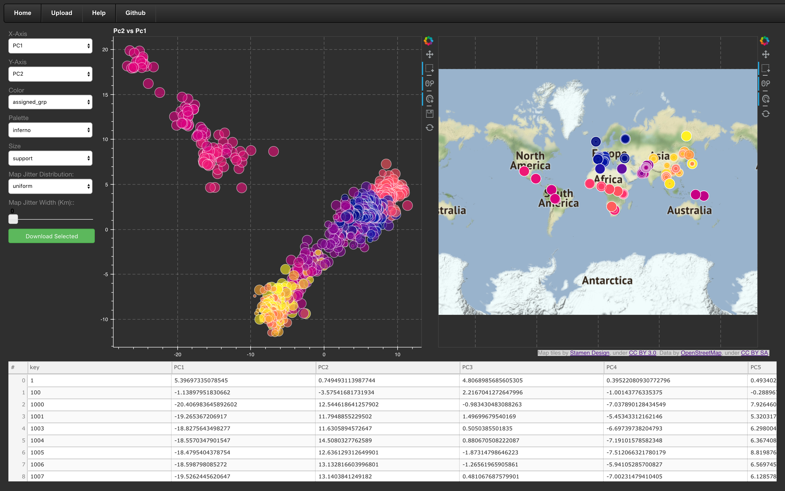

mvMapper
========

Try a hosted instance of mvMapper [Here](http://ctahr-peps.colo.hawaii.edu/)!


**mvMapper** (Multivariate Mapper) is an interactive data exploration tool for multivariate analyses with associated geographic location information. Although we developed mvMapper with population genetic data in mind, it will ingest results of virtually any multivariate analysis of georeferenced data. mvMapper’s greatest strength is facilitating dynamic exploration of the statistical and geographic frameworks side-by-side, a task that is difficult and time-consuming to do in static space. It displays a scatterplot with selectors for x-axis, y-axis, point color, point size, and color pallet in addition to a world map with optional jitter to separate overlapping points. Data selections are linked across the two plots, and a data table below shows details of the selected data, which can also be downloaded as a csv.

Table of contents
=================

  * [mvMapper](#mvMapper)
  * [Table of contents](#table-of-contents)
  * [Hosted Example](#hosted-example)
  * [Input Files](#input-files)
  * [Run Using Docker](#run-using-docker)
  * [Run Without Docker](#run-without-docker)
  * [Example Data](#example-data)

Hosted Example
==============

A hosted instance of **mvMapper** is available [Here](http://ctahr-peps.colo.hawaii.edu/). See the corresponding [help](http://ctahr-peps.colo.hawaii.edu/help) page for usage instructions. **Note**, the web app loads slowly on some internet connections. If all you see is a grey screen and the navigation bar, give it a moment!

Input Files
===========

See [helpPage.md](webapp/helpPage.md) for an example pipeline using **mvMapper** with **DAPC** in **adegenet**. Note `webapp/helpPage.md` is the source for the help page of the site and can be customized according to your deployment.

The web app uses `webapp/data` and `webapp/config` directories for user provided data and configuration files.
These files can be selected by adding their file names as optional parameters to the URL following the form:

```
<base_url>/?c=<config_filename>&d=<data_filename>
```

Data
-----

This webapp is built to be modular and generalized.
Because of this, it is relatively easy to adapt it to visualize data from various sources.
The webapp consumes a csv file that, at minimum, includes a `key` column (individual identifiers),
as well as `lat` and `lon` columns containing the decimal coordinates associated with each sample.
Additional columns are optional.

Note that `easting` and `northing` are reserved column names used internally, so they should be avoided in the input data file.

Configuration
-------------

The provided `defaultConfig.toml` config file sets the webapp up for use with the results from a DAPC.
All available options are documented as comments, please follow it as an example to create custom config files.

Run Using Docker
================

If you have an os that supports [Docker](https://www.docker.com/), it can provide a straightforward install process. Note that on some systems, Docker has to run as root.

On systems which run docker in a virtual machine (such as older windows systems), mvMapper will need to be served using the instructions for remote access found below.

Install
-------

Once docker is installed, pull the mvMapper container from [our Docker Hub page](https://hub.docker.com/r/genomeannotation/mvmapper):

```
docker pull popphylotools/mvmapper
```

Building the Docker locally from source is relatively easy as well:

```
git clone https://github.com/popphylotools/mvMapper.git
cd mvMapper
docker build -t popphylotools/mvmapper:local_build .
```

Serve
-----

For local access, by default, the webapp can be accessed at `localhost:5006`.
Simply run the mvMapper Docker in demon mode and forward port 5006 to the host:

```
docker run -d \
-p 5006:5006 \
popphylotools/mvmapper:latest
```

If data and config directories are to be managed from the host, host directories can be mounted in place of the containers data and config volumes.
Note that `rosenbergData.csv` (or whatever you have configured as the default data file) should be placed in the data directory as host directories will not have files automatically copied into them during Docker set up.

```
docker run -d \
-p 5006:5006 \
-v <absolute_path_to_host_data_dir>:/mvMapper/data \
-v <absolute_path_to_host_config_dir>:/mvMapper/config \
popphylotools/mvmapper:latest
```

For remote access, the default `APP_URL` and `APP_PORT` environmental variables need to be redefined to reflect the address and port at which the web app should be accessible.

```
docker run -d \
-p <port_at_which_app_will_be_accessed>:5006 \
-e "APP_URL=<url_at_which_app_will_be_accessed>" \
-e "APP_PORT=<port_at_which_app_will_be_accessed>" \
-v <absolute_path_to_host_data_dir>:/mvMapper/data \
-v <absolute_path_to_host_config_dir>:/mvMapper/config \
popphylotools/mvmapper:latest
```

If it is desirable for old user uploaded data to be deleted, set the `DAYS_TO_KEEP_DATA` environment variable in the docker run command.
For instance, to delete user uploaded data after 2 weeks, add the following line to the above docker run command:

```
-e "DAYS_TO_KEEP_DATA=14" \
```

Note that the cron job that handles deletion will ignore file names containing a `.`.
Data files uploaded through the web interface are assigned a random name with no extension and will thus be affected,
whereas data files added manually should be given the extension `.csv` and will be left alone.

Run Without Docker
==================

When running mvMapper on systems which do not support Docker, the `Dockerfile` can be followed as a guide.

Install
-------

We support installation of dependencies as an anaconda environment using the provided environment.yml.

Once [Anaconda](https://docs.continuum.io/anaconda/install/) is installed:

```
git clone https://github.com/popphylotools/mvMapper.git
cd mvMapper
conda env create
```

Serve
-----

To run mvMapper, activate the conda env, then run main.py with the appropriate parameters.

```
source activate mvmapper
python webapp/main.py <url_at_which_app_will_be_accessed>:<port_at_which_app_will_be_accessed> <port_at_which_app_will_be_accessed>
```

For local access for instance, the final command will be `python main.py localhost:5006 5006`

Example Data
============

Example data (783 autosomal microsatellite loci genotyped for 1048 individuals from 53 populations) from 
Rosenberg NA, Mahajan S, Ramachandran S, Zhao C, Pritchard JK, Feldman MW (2005) Clines, clusters, and the effect of study design on the inference of human population structure. PLoS Genetics 1:660-671.
Available from <https://rosenberglab.stanford.edu/diversity.html>
